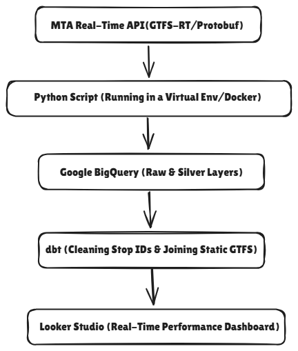

# NYC MTA Real-Time Transit Data Pipeline

## 🚀 Executive Summary
This project is an end-to-end ELT (Extract, Load, Transform) pipeline that ingests high-velocity transit data from the NYC MTA. It processes real-time subway arrival updates to monitor system performance, tracking over **1M records a day** with a 1-minute data freshness latency.

## 🛠️ The Tech Stack
* **Ingestion:** Python (Requests, GTFS-Realtime/Protobuf)
* **Data Warehouse:** Google BigQuery
* **Transformation:** dbt (Data Build Tool)
* **Visualization:** Looker Studio

## 🏗️ Architecture & Lineage
The pipeline extracts Protobuf feeds from the MTA API, loads them into BigQuery "Raw" tables, and utilizes **dbt** to sanitize Station IDs and join them with static GTFS data for geospatial mapping.

## 💡 Key Engineering Challenges & Solutions
### 1. The ID Mismatch Problem
**Challenge:** Real-time feeds use dynamic `stop_id` suffixes (N/S) that do not exist in static schedule files, causing join failures.
**Solution:** Engineered a dbt transformation layer using Regex to strip suffixes, ensuring a 100% match rate between live trips and physical station coordinates.

### 2. Custom Business Logic
I implemented custom SQL logic in the BI layer to define system health:
* **Stale Data:** Records with no updates for > 24 hours.
* **Delayed:** Arrivals verified at ≥ 5 minutes behind schedule.
* **On Time:** Arrivals within a 5-minute variance of the scheduled time.

## 📊 Dashboard Insights
The final dashboard provides a "Transit Operations Center" view of the NYC subway system:
* **Real-Time Fleet Map:** Live geospatial tracking of active trips.
* **Service Reliability:** KPI scorecards measuring On-Time Performance (OTP).
* **Traffic Analysis:** Identification of system bottlenecks at high-traffic stations like 42 St-Port Authority.

## 📊 Live Dashboard
[**Click here to view the Live NYC MTA Operational Dashboard**](https://lookerstudio.google.com/s/spKzCEr5uZ0)
